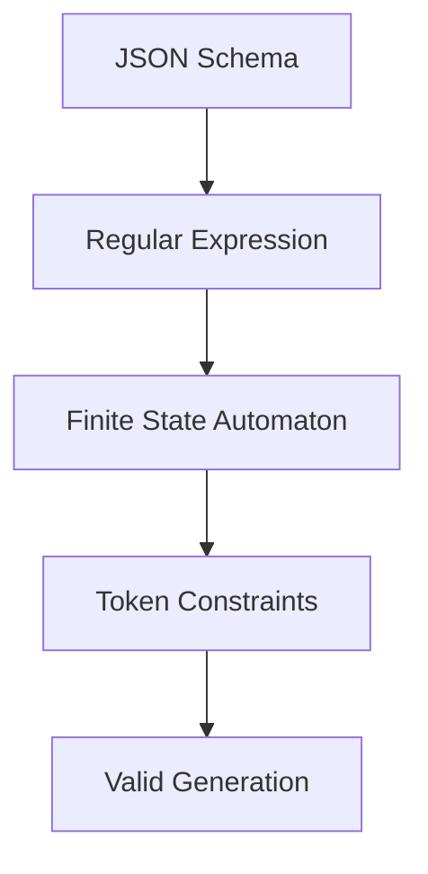

# The Complete Guide to Outlines-Core: Structured Text Generation Made Simple

## Table of Contents
1. [What is Outlines and Why Should You Care?](#what-is-outlines-and-why-should-you-care)
2. [The Core Problem Outlines Solves](#the-core-problem-outlines-solves)
3. [How Outlines Works Under the Hood](#how-outlines-works-under-the-hood)
4. [Core Components Deep Dive](#core-components-deep-dive)
5. [Practical Usage Patterns](#practical-usage-patterns)
6. [JSON Schema Support Reference](#json-schema-support-reference)
7. [Performance Tips and Best Practices](#performance-tips-and-best-practices)
8. [Common Pitfalls and How to Avoid Them](#common-pitfalls-and-how-to-avoid-them)
9. [Real-World Examples](#real-world-examples)
10. [Troubleshooting Guide](#troubleshooting-guide)

---

## What is Outlines and Why Should You Care?

### The Simple Explanation
Imagine you have a language model (like GPT) that can generate text, but it's like a very smart person who doesn't follow instructions well. You ask for a JSON object, and sometimes you get:
- Valid JSON: `{"name": "John", "age": 30}` ✅
- Invalid JSON: `{"name": "John", age: 30}` ❌ (missing quotes)
- Almost JSON: `The person's name is John and age is 30` ❌ (not JSON at all)

**Outlines ensures your language model ALWAYS produces exactly the format you want, every single time.**

### What Makes It Special
- **Guarantees**: 100% valid output format, no parsing failures
- **Speed**: Uses finite state automata (fancy math) to be incredibly fast
- **Flexibility**: Works with any format you can describe with JSON Schema or regex
- **Integration**: Works with any language model that exposes token probabilities

---

## The Core Problem Outlines Solves

### Traditional Approach (Unreliable)
```
You: "Generate a JSON object with name and age"
Model: "Here's a JSON object: {'name': 'John', 'age': 30}"  // Invalid JSON!
You: *parsing fails* 😢
```

### Outlines Approach (Guaranteed)
```
You: "Generate a JSON object with name and age"
Outlines: *constrains model to only output valid JSON tokens*
Model: {"name": "John", "age": 30}  // Always valid! ✅
```

### Technical Problem Being Solved
1. **Token-level constraint**: Language models generate text one token at a time
2. **Validation happens too late**: Traditional approaches validate after full generation
3. **No recovery mechanism**: If generation goes wrong, you have to start over
4. **Outlines solution**: Constrain each token choice to only allow valid continuations

---

## How Outlines Works Under the Hood

### The Magic in 4 Steps



**Step 1: Schema to Regex**
```json
{"type": "string"}
```
↓ Converts to regex ↓
```regex
"([^"\\\\\\x00-\\x1F\\x7F-\\x9F]|\\\\[\"\\\\])*"
```

**Step 2: Regex to State Machine**
```
State 0: Can accept: ["]
State 1: Can accept: [a-z, A-Z, 0-9, space, ...]
State 2: Can accept: ["]
State 3: FINAL (complete string)
```

**Step 3: Map Tokens to States**
```
Current State: 1 (inside string)
Available tokens: ["hello", "world", "123", ...]
Forbidden tokens: ["{", "}", "]", ...]
```

**Step 4: Real-time Filtering**
```
Model wants: ["{": 0.8, "hello": 0.15, "}": 0.05]
Outlines allows: ["hello": 0.15] (renormalized to 1.0)
Model generates: "hello"
```

### The Mathematical Foundation

**Finite State Automaton (FSA)**
- Each state represents a position in the valid format
- Transitions define which characters/tokens are allowed next
- Final states indicate complete, valid outputs

**Token Vocabulary Mapping**
- Maps each token in the model's vocabulary to byte sequences
- Handles different tokenization schemes (GPT-2, LLaMA, etc.)
- Accounts for special tokens, Unicode, byte-fallback encoding

**Regex Compilation**
- Converts JSON Schema to regex patterns
- Handles recursive structures with depth limits
- Optimizes for common patterns

---

## Core Components Deep Dive

### 1. Vocabulary (`Vocabulary`)

**What it does**: Maps between human-readable text and model tokens

```rust
// Creating from a pretrained model
let vocabulary = Vocabulary::from_pretrained("openai-community/gpt2", None)?;

// Manual creation
let mut vocabulary = Vocabulary::new(50256); // EOS token ID
vocabulary.try_insert("hello", 123)?;
vocabulary.try_insert(" world", 456)?;
```

**Key concepts**:
- **Tokens**: Model's internal representation (numbers like 123, 456)
- **Text**: Human-readable strings ("hello", " world")
- **EOS Token**: Special "end of sequence" token
- **Byte-level encoding**: How tokens map to actual bytes

**Tokenization Examples**:
```
GPT-2 style:
"hello world" → ["hello", " world"] → [123, 456]

LLaMA style:
"hello world" → ["▁hello", "▁world"] → [123, 456]
" " → ["▁"] or ["<0x20>"] → [789] or [999]
```

### 2. Index (`Index`)

**What it does**: The brain that maps tokens to valid state transitions

```rust
let regex = r#""[a-zA-Z]+""#;  // Simple string pattern
let index = Index::new(regex, &vocabulary)?;

// Usage
let current_state = index.initial_state();
let allowed_tokens = index.allowed_tokens(&current_state)?;
let next_state = index.next_state(&current_state, &token_id)?;
```

**Key concepts**:
- **States**: Positions in the automaton (like being "inside quotes" or "after comma")
- **Transitions**: Valid moves from one state to another
- **Final states**: States where generation can legitimately end

**State Machine Example**:
```
For pattern: "hello"

State 0 → ["] → State 1
State 1 → [h] → State 2  
State 2 → [e] → State 3
State 3 → [l] → State 4
State 4 → [l] → State 5
State 5 → [o] → State 6
State 6 → ["] → State 7 (FINAL)
```

### 3. Guide (`Guide`)

**What it does**: High-level interface that tracks generation state

```rust
let mut guide = Guide::new(index, 32); // 32 = rollback buffer size

// Generation loop
loop {
    let allowed = guide.get_tokens()?;
    let chosen_token = model.sample_from(allowed);
    let new_allowed = guide.advance(chosen_token, true)?;
    
    if guide.is_finished() {
        break;
    }
}
```

**Key features**:
- **State tracking**: Remembers where you are in generation
- **Rollback**: Can undo recent tokens if needed
- **Token filtering**: Gives you only valid next tokens

### 4. JSON Schema Parser (`json_schema`)

**What it does**: Converts JSON Schema to regex patterns

```rust
let schema = r#"{
    "type": "object",
    "properties": {
        "name": {"type": "string"},
        "age": {"type": "integer"}
    },
    "required": ["name", "age"]
}"#;

let regex = json_schema::regex_from_str(schema, None, None)?;
// Result: Complex regex that matches valid JSON objects
```

**Supported features**:
- All basic types: string, number, integer, boolean, null, array, object
- Constraints: minLength, maxLength, minItems, maxItems, pattern
- Logical operators: allOf, anyOf, oneOf
- References: $ref (local only)
- Formats: uuid, date-time, date, time, email, uri

---

## Practical Usage Patterns

### Pattern 1: Simple JSON Generation

```julia
# Julia example
function generate_person_json(model)
    schema = """
    {
        "type": "object",
        "properties": {
            "name": {"type": "string"},
            "age": {"type": "integer", "minimum": 0, "maximum": 150}
        },
        "required": ["name", "age"]
    }
    """
    
    # Convert schema to regex
    regex_ptr = Ref{Ptr{Cchar}}()
    result = @ccall liboutlines.outlines_regex_from_schema(
        schema::Ptr{Cchar}, regex_ptr::Ptr{Ptr{Cchar}})::Cint
    
    regex = unsafe_string(regex_ptr[])
    @ccall liboutlines.outlines_free_string(regex_ptr[]::Ptr{Cchar})::Cvoid
    
    # Create vocabulary and index
    vocab_handle = create_vocabulary("gpt2")
    index_handle = create_index(regex, vocab_handle)
    
    # Generate
    current_state = get_initial_state(index_handle)
    result = ""
    
    while !is_final_state(index_handle, current_state)
        allowed_tokens = get_allowed_tokens(index_handle, current_state)
        chosen_token = model.sample_from(allowed_tokens)
        current_state = get_next_state(index_handle, current_state, chosen_token)
        result *= detokenize(chosen_token)
    end
    
    return JSON.parse(result)  # Guaranteed to work!
end
```

### Pattern 2: Email Validation

```julia
function generate_email()
    schema = """
    {
        "type": "string",
        "format": "email"
    }
    """
    # Will generate: someone@example.com, user.name@domain.org, etc.
end
```

### Pattern 3: Enum Selection

```julia
function generate_choice()
    schema = """
    {
        "enum": ["red", "green", "blue", "yellow"]
    }
    """
    # Will generate exactly one of: "red", "green", "blue", "yellow"
end
```

### Pattern 4: Complex Nested Objects

```julia
function generate_complex_data()
    schema = """
    {
        "type": "object",
        "properties": {
            "users": {
                "type": "array",
                "items": {
                    "type": "object",
                    "properties": {
                        "id": {"type": "integer"},
                        "profile": {
                            "type": "object",
                            "properties": {
                                "name": {"type": "string"},
                                "emails": {
                                    "type": "array",
                                    "items": {"type": "string", "format": "email"}
                                }
                            }
                        }
                    }
                }
            }
        }
    }
    """
    # Generates complex nested structures with arrays of objects
end
```

### Pattern 5: Custom Regex

```julia
function generate_phone_number()
    # Direct regex approach for formats not in JSON Schema
    regex = raw"\\+1-\\d{3}-\\d{3}-\\d{4}"
    # Will generate: +1-555-123-4567
end
```

---

## JSON Schema Support Reference

### Supported Types

#### String
```json
{
    "type": "string",
    "minLength": 1,
    "maxLength": 100,
    "pattern": "^[A-Z][a-z]+$"
}
```

#### Number/Integer
```json
{
    "type": "integer",
    "minDigits": 1,
    "maxDigits": 5
}
```

#### Boolean
```json
{"type": "boolean"}  // Generates: true or false
```

#### Null
```json
{"type": "null"}  // Generates: null
```

#### Array
```json
{
    "type": "array",
    "items": {"type": "string"},
    "minItems": 1,
    "maxItems": 5
}
```

#### Object
```json
{
    "type": "object",
    "properties": {
        "required_field": {"type": "string"},
        "optional_field": {"type": "integer"}
    },
    "required": ["required_field"],
    "additionalProperties": false
}
```

### Logical Operators

#### allOf (AND)
```json
{
    "allOf": [
        {"type": "string"},
        {"minLength": 5}
    ]
}
```

#### anyOf (OR)
```json
{
    "anyOf": [
        {"type": "string"},
        {"type": "integer"}
    ]
}
```

#### oneOf (XOR)
```json
{
    "oneOf": [
        {"type": "string"},
        {"type": "integer"}
    ]
}
```

### Format Types

#### Date/Time
```json
{"type": "string", "format": "date"}        // "2023-12-25"
{"type": "string", "format": "time"}        // "14:30:00Z"
{"type": "string", "format": "date-time"}   // "2023-12-25T14:30:00Z"
```

#### Identifiers
```json
{"type": "string", "format": "uuid"}        // "123e4567-e89b-12d3-a456-426614174000"
{"type": "string", "format": "email"}       // "user@example.com"
{"type": "string", "format": "uri"}         // "https://example.com"
```

### References
```json
{
    "definitions": {
        "person": {
            "type": "object",
            "properties": {
                "name": {"type": "string"}
            }
        }
    },
    "type": "array",
    "items": {"$ref": "#/definitions/person"}
}
```

### Limitations

**Not Supported**:
- External references (`$ref` to other files/URLs)
- `if`/`then`/`else` conditional schemas
- `patternProperties`
- Complex format validations beyond the built-in list
- Infinite recursion (max depth: 3 by default)

**Recursion Limits**:
```julia
# Default max depth: 3
regex = json_schema_to_regex(schema, nothing, 3)

# Increase for complex structures (use cautiously!)
regex = json_schema_to_regex(schema, nothing, 5)
```

---

## Performance Tips and Best Practices

### 1. Index Construction is Expensive, Reuse It

**❌ Bad**:
```julia
function generate_many_items(schemas)
    results = []
    for schema in schemas
        index = create_index_from_schema(schema)  # Expensive!
        result = generate_with_index(index)
        push!(results, result)
        free_index(index)
    end
    return results
end
```

**✅ Good**:
```julia
function generate_many_items(schema, count)
    index = create_index_from_schema(schema)  # Once!
    results = []
    for i in 1:count
        result = generate_with_index(index)  # Reuse!
        push!(results, result)
    end
    free_index(index)
    return results
end
```

### 2. Vocabulary is Also Expensive

**✅ Best Practice**:
```julia
# Global vocabulary (initialize once)
const GLOBAL_VOCAB = create_vocabulary("openai-community/gpt2")

function my_generation_function()
    # Use global vocabulary
    index = create_index(regex, GLOBAL_VOCAB)
    # ... generate
end
```

### 3. Memory Management

**Critical**: Always free allocated memory!

```julia
function safe_generation(schema)
    vocab_handle = 0
    index_handle = 0
    
    try
        vocab_handle = create_vocabulary("gpt2")
        index_handle = create_index_from_schema(schema, vocab_handle)
        
        # ... do generation
        
        return result
    finally
        if index_handle != 0
            @ccall liboutlines.outlines_free_index(index_handle::UInt64)::Cvoid
        end
        if vocab_handle != 0
            @ccall liboutlines.outlines_free_vocabulary(vocab_handle::UInt64)::Cvoid
        end
    end
end
```

### 4. Schema Complexity vs Performance

**Simple schema** (fast):
```json
{"type": "string", "maxLength": 100}
```

**Complex schema** (slower):
```json
{
    "type": "object",
    "properties": {
        "deeply": {
            "type": "object",
            "properties": {
                "nested": {
                    "type": "array",
                    "items": {
                        "anyOf": [
                            {"type": "string"},
                            {"type": "integer"},
                            {"$ref": "#/definitions/recursive_type"}
                        ]
                    }
                }
            }
        }
    }
}
```

**Performance factors**:
- **Recursion depth**: Higher = exponentially slower
- **anyOf/oneOf complexity**: More alternatives = larger automaton
- **String patterns**: Complex regex = slower construction

### 5. Batch Processing

**✅ Efficient for multiple generations**:
```julia
function batch_generate(schema, prompts)
    # One-time setup
    vocab = create_vocabulary("gpt2")
    index = create_index_from_schema(schema, vocab)
    
    results = []
    for prompt in prompts
        # Fast generation (reusing index)
        result = generate_with_prompt(index, prompt)
        push!(results, result)
    end
    
    # Cleanup
    free_index(index)
    free_vocabulary(vocab)
    
    return results
end
```

---

## Common Pitfalls and How to Avoid Them

### 1. Memory Leaks

**Problem**: Forgetting to free C-allocated memory
```julia
# ❌ Memory leak!
function bad_example()
    vocab = create_vocabulary("gpt2")
    # ... use vocab
    # Missing: free_vocabulary(vocab)
end
```

**Solution**: Always use try/finally or RAII patterns
```julia
# ✅ Safe
function good_example()
    vocab = create_vocabulary("gpt2")
    try
        # ... use vocab
        return result
    finally
        free_vocabulary(vocab)
    end
end
```

### 2. Invalid Schema

**Problem**: Schema errors discovered late
```julia
# ❌ Runtime error
schema = """{"type": "invalid_type"}"""
index = create_index_from_schema(schema)  # Fails here!
```

**Solution**: Validate schemas early
```julia
# ✅ Validate first
function validate_and_create(schema)
    # Test with simple regex generation first
    try
        regex = schema_to_regex(schema)
        println("Schema valid, regex: ", regex)
        return create_index_from_schema(schema)
    catch e
        error("Invalid schema: $e")
    end
end
```

### 3. Token Vocabulary Mismatches

**Problem**: Using wrong tokenizer
```julia
# ❌ Mismatch between model and vocabulary
model = load_llama_model()
vocab = create_vocabulary("openai-community/gpt2")  # Wrong tokenizer!
```

**Solution**: Match vocabulary to model
```julia
# ✅ Correct pairing
model = load_llama_model()
vocab = create_vocabulary("meta-llama/Llama-2-7b-hf")
```

### 4. Recursion Depth Explosion

**Problem**: Complex recursive schemas
```json
{
    "type": "object",
    "properties": {
        "children": {
            "type": "array", 
            "items": {"$ref": "#"}
        }
    }
}
```

**Solution**: Limit recursion depth
```julia
# ✅ Controlled recursion
regex = schema_to_regex_with_depth(schema, 2)  # Max depth: 2
```

### 5. Incomplete Generation Detection

**Problem**: Not checking if generation finished properly
```julia
# ❌ Might produce incomplete output
while true
    tokens = get_allowed_tokens(state)
    if isempty(tokens)  # Wrong check!
        break
    end
    # ... generate
end
```

**Solution**: Use proper final state checking
```julia
# ✅ Correct termination
while !is_final_state(index, current_state)
    tokens = get_allowed_tokens(index, current_state)
    # ... generate
end
```

---

## Real-World Examples

### Example 1: API Response Generation

**Scenario**: Generate consistent API responses

```julia
function generate_api_response(user_query)
    schema = """
    {
        "type": "object",
        "properties": {
            "status": {"enum": ["success", "error"]},
            "data": {
                "type": "object",
                "properties": {
                    "result": {"type": "string"},
                    "confidence": {"type": "number", "minimum": 0, "maximum": 1}
                }
            },
            "timestamp": {"type": "string", "format": "date-time"}
        },
        "required": ["status", "data", "timestamp"]
    }
    """
    
    # This ALWAYS produces valid API responses
    return constrained_generate(schema, user_query)
end

# Example outputs:
# {"status": "success", "data": {"result": "Found 5 items", "confidence": 0.95}, "timestamp": "2023-12-25T10:30:00Z"}
# {"status": "error", "data": {"result": "Invalid query", "confidence": 0.1}, "timestamp": "2023-12-25T10:31:00Z"}
```

### Example 2: Configuration File Generation

**Scenario**: Generate valid config files

```julia
function generate_app_config()
    schema = """
    {
        "type": "object",
        "properties": {
            "database": {
                "type": "object",
                "properties": {
                    "host": {"type": "string", "format": "uri"},
                    "port": {"type": "integer", "minimum": 1, "maximum": 65535},
                    "ssl": {"type": "boolean"}
                },
                "required": ["host", "port"]
            },
            "logging": {
                "type": "object",
                "properties": {
                    "level": {"enum": ["debug", "info", "warn", "error"]},
                    "file": {"type": "string"}
                }
            }
        },
        "required": ["database"]
    }
    """
    
    return constrained_generate(schema)
end
```

### Example 3: Data Extraction

**Scenario**: Extract structured data from unstructured text

```julia
function extract_contact_info(text)
    schema = """
    {
        "type": "object",
        "properties": {
            "name": {"type": "string"},
            "email": {"type": "string", "format": "email"},
            "phone": {"type": "string", "pattern": "^\\\\+?[0-9-() ]+$"},
            "address": {
                "type": "object",
                "properties": {
                    "street": {"type": "string"},
                    "city": {"type": "string"},
                    "country": {"type": "string"}
                }
            }
        },
        "required": ["name"]
    }
    """
    
    prompt = "Extract contact information from: $text"
    return constrained_generate(schema, prompt)
end
```

### Example 4: Code Generation

**Scenario**: Generate valid code snippets

```julia
function generate_sql_query()
    schema = """
    {
        "type": "object",
        "properties": {
            "query_type": {"enum": ["SELECT", "INSERT", "UPDATE", "DELETE"]},
            "table": {"type": "string", "pattern": "^[a-zA-Z_][a-zA-Z0-9_]*$"},
            "columns": {
                "type": "array",
                "items": {"type": "string", "pattern": "^[a-zA-Z_][a-zA-Z0-9_]*$"}
            },
            "conditions": {
                "type": "array",
                "items": {
                    "type": "object",
                    "properties": {
                        "column": {"type": "string"},
                        "operator": {"enum": ["=", "!=", ">", "<", ">=", "<=", "LIKE"]},
                        "value": {"type": "string"}
                    }
                }
            }
        },
        "required": ["query_type", "table"]
    }
    """
    
    return constrained_generate(schema)
end
```

### Example 5: Multi-Language Support

**Scenario**: Generate responses in specific formats across languages

```julia
function generate_multilingual_response(language, content)
    schema = """
    {
        "type": "object",
        "properties": {
            "language": {"enum": ["en", "es", "fr", "de", "zh", "ja"]},
            "response": {"type": "string", "minLength": 10},
            "metadata": {
                "type": "object",
                "properties": {
                    "confidence": {"type": "number", "minimum": 0, "maximum": 1},
                    "translation_needed": {"type": "boolean"}
                }
            }
        },
        "required": ["language", "response"]
    }
    """
    
    prompt = "Respond in $language: $content"
    return constrained_generate(schema, prompt)
end
```

---

## Troubleshooting Guide

### Common Error Messages and Solutions

#### "Failed to create vocabulary"
**Cause**: Network issues or invalid model name
```julia
# ❌ Problem
vocab = create_vocabulary("non-existent-model")

# ✅ Solution
try
    vocab = create_vocabulary("openai-community/gpt2")
catch e
    println("Using fallback vocabulary")
    vocab = create_vocabulary("gpt2")  # Alternative name
end
```

#### "Schema parsing error"
**Cause**: Invalid JSON Schema
```julia
# ❌ Problem
schema = """{"type": "invalid"}"""

# ✅ Solution
# Validate schema structure
schema = """{"type": "string"}"""  # Start simple
```

#### "Index creation failed"
**Cause**: Regex too complex or incompatible with vocabulary
```julia
# ❌ Problem
regex = "(?:very|complex|regex|with|lookaheads)(?=\\d+)"

# ✅ Solution
# Simplify regex or use JSON Schema instead
schema = """{"type": "string", "pattern": "^(very|complex|regex)\\\\d+$"}"""
```

#### "Invalid state" errors
**Cause**: State corruption or incorrect usage
```julia
# ❌ Problem
state = get_next_state(index, current_state, invalid_token)

# ✅ Solution
# Always check allowed tokens first
allowed = get_allowed_tokens(index, current_state)
if token_id in allowed
    state = get_next_state(index, current_state, token_id)
end
```

### Debugging Tips

#### 1. Enable Verbose Output
```julia
function debug_generation(schema)
    println("Schema: ", schema)
    
    regex = schema_to_regex(schema)
    println("Generated regex: ", regex)
    
    vocab = create_vocabulary("gpt2")
    index = create_index(regex, vocab)
    
    state = get_initial_state(index)
    println("Initial state: ", state)
    
    allowed = get_allowed_tokens(index, state)
    println("Allowed tokens: ", length(allowed))
    
    # Continue with detailed logging...
end
```

#### 2. Test with Simple Cases
```julia
function test_progression()
    # Start simple
    simple_schema = """{"type": "string"}"""
    test_schema(simple_schema)
    
    # Add constraints gradually
    constrained_schema = """{"type": "string", "maxLength": 10}"""
    test_schema(constrained_schema)
    
    # Add complexity step by step
    object_schema = """{"type": "object", "properties": {"name": {"type": "string"}}}"""
    test_schema(object_schema)
end
```

#### 3. Memory Leak Detection
```julia
function detect_leaks()
    initial_memory = get_memory_usage()
    
    for i in 1:1000
        vocab = create_vocabulary("gpt2")
        index = create_index_from_schema(simple_schema, vocab)
        
        # Clean up
        free_index(index)
        free_vocabulary(vocab)
        
        if i % 100 == 0
            current_memory = get_memory_usage()
            println("Iteration $i, memory: $(current_memory - initial_memory) MB")
        end
    end
end
```

### Performance Monitoring

#### 1. Timing Different Operations
```julia
function benchmark_operations()
    # Vocabulary creation
    @time vocab = create_vocabulary("gpt2")
    
    # Schema compilation
    @time regex = schema_to_regex(complex_schema)
    
    # Index creation
    @time index = create_index(regex, vocab)
    
    # Token generation
    state = get_initial_state(index)
    @time allowed = get_allowed_tokens(index, state)
    
    println("Vocabulary size: ", vocabulary_size(vocab))
    println("Allowed tokens: ", length(allowed))
end
```

#### 2. Memory Usage Tracking
```julia
function monitor_memory_usage(schema, iterations)
    vocab = create_vocabulary("gpt2")
    index = create_index_from_schema(schema, vocab)
    
    for i in 1:iterations
        state = get_initial_state(index)
        
        # Simulate generation
        for step in 1:100
            allowed = get_allowed_tokens(index, state)
            if isempty(allowed) || is_final_state(index, state)
                break
            end
            
            # Pick random allowed token
            token = rand(allowed)
            state = get_next_state(index, state, token)
        end
        
        if i % 100 == 0
            GC.gc()  # Force garbage collection
            memory_mb = Sys.total_memory() / 1024^2
            println("Iteration $i: $(memory_mb) MB")
        end
    end
end
```

---

## Advanced Topics

### Custom Tokenization Strategies

If you need to work with custom tokenizers or handle special cases:

```julia
# Handle byte-level tokenization
function handle_byte_tokens(vocab_handle, text)
    # Convert text to bytes
    bytes = codeunits(text)
    
    # Get token IDs for each byte sequence
    tokens = []
    for byte_val in bytes
        token_ids = get_token_ids_for_bytes(vocab_handle, [byte_val])
        append!(tokens, token_ids)
    end
    
    return tokens
end
```

### Extending JSON Schema Support

For unsupported JSON Schema features, you can often work around them:

```julia
# Custom pattern for credit card numbers
function credit_card_schema()
    # JSON Schema doesn't have credit card format, use pattern instead
    return """
    {
        "type": "string",
        "pattern": "^[0-9]{4}-[0-9]{4}-[0-9]{4}-[0-9]{4}$"
    }
    """
end

# Complex conditional logic via anyOf
function conditional_schema()
    return """
    {
        "anyOf": [
            {
                "type": "object",
                "properties": {
                    "type": {"const": "person"},
                    "name": {"type": "string"},
                    "age": {"type": "integer"}
                },
                "required": ["type", "name", "age"]
            },
            {
                "type": "object", 
                "properties": {
                    "type": {"const": "company"},
                    "company_name": {"type": "string"},
                    "tax_id": {"type": "string"}
                },
                "required": ["type", "company_name", "tax_id"]
            }
        ]
    }
    """
end
```

### Custom Regex Patterns

For formats that JSON Schema can't express, use direct regex:

```julia
function create_custom_patterns()
    patterns = Dict(
        # IPv4 addresses
        "ipv4" => raw"^(?:(?:25[0-5]|2[0-4][0-9]|[01]?[0-9][0-9]?)\.){3}(?:25[0-5]|2[0-4][0-9]|[01]?[0-9][0-9]?)$",
        
        # Social Security Numbers
        "ssn" => raw"^\d{3}-\d{2}-\d{4}$",
        
        # License plates (US format)
        "license_plate" => raw"^[A-Z]{3}-\d{4}$",
        
        # Semantic version numbers
        "semver" => raw"^\d+\.\d+\.\d+(-[a-zA-Z0-9]+)?$"
    )
    
    return patterns
end

function generate_with_custom_pattern(pattern_name, vocab)
    patterns = create_custom_patterns()
    regex = patterns[pattern_name]
    
    index = create_index(regex, vocab)
    return generate_text_with_index(index)
end
```

### Multi-Schema Generation

Generate content that conforms to multiple schemas simultaneously:

```julia
function multi_schema_generation()
    # Generate an object that's both a valid person AND employee
    person_schema = """
    {
        "type": "object",
        "properties": {
            "name": {"type": "string"},
            "age": {"type": "integer"}
        },
        "required": ["name", "age"]
    }
    """
    
    employee_schema = """
    {
        "type": "object", 
        "properties": {
            "employee_id": {"type": "string"},
            "department": {"type": "string"}
        },
        "required": ["employee_id", "department"]
    }
    """
    
    # Combine using allOf
    combined_schema = """
    {
        "allOf": [
            $person_schema,
            $employee_schema
        ]
    }
    """
    
    return generate_with_schema(combined_schema)
end
```

---

## Integration Patterns

### With Web APIs

```julia
# Generate API request bodies
function generate_api_request(endpoint_schema)
    function make_request(user_input)
        # Generate valid request body
        request_body = constrained_generate(endpoint_schema, user_input)
        
        # Parse as JSON (guaranteed to work!)
        json_data = JSON.parse(request_body)
        
        # Make HTTP request
        response = HTTP.post("https://api.example.com/endpoint", 
                           headers=["Content-Type" => "application/json"],
                           body=request_body)
        
        return response
    end
    
    return make_request
end
```

### With Databases

```julia
# Generate database queries
function generate_safe_queries()
    query_schema = """
    {
        "type": "object",
        "properties": {
            "action": {"enum": ["SELECT", "INSERT", "UPDATE"]},
            "table": {"type": "string", "pattern": "^[a-zA-Z_][a-zA-Z0-9_]*$"},
            "columns": {
                "type": "array",
                "items": {"type": "string", "pattern": "^[a-zA-Z_][a-zA-Z0-9_]*$"}
            },
            "where_clause": {
                "type": "object",
                "properties": {
                    "column": {"type": "string", "pattern": "^[a-zA-Z_][a-zA-Z0-9_]*$"},
                    "value": {"type": "string"}
                }
            }
        }
    }
    """
    
    # Generate structured query representation
    query_obj = JSON.parse(constrained_generate(query_schema))
    
    # Convert to safe SQL (no injection possible!)
    return build_sql_from_object(query_obj)
end
```

### With Machine Learning Pipelines

```julia
# Generate training data
function generate_training_data(schema, count)
    vocab = create_vocabulary("gpt2")
    index = create_index_from_schema(schema, vocab)
    
    training_examples = []
    
    for i in 1:count
        # Generate diverse examples
        example = generate_with_index(index, 
                                    temperature=0.8,  # Add randomness
                                    top_k=50)
        
        # Validate (should always pass!)
        @assert is_valid_json(example, schema)
        
        push!(training_examples, JSON.parse(example))
    end
    
    free_index(index)
    free_vocabulary(vocab)
    
    return training_examples
end
```

---

## Performance Optimization Deep Dive

### Understanding the Bottlenecks

1. **Index Construction**: O(V × S) where V = vocabulary size, S = states
2. **Token Lookup**: O(1) hash table lookup  
3. **State Transitions**: O(1) state machine traversal
4. **Memory Usage**: O(V + S) for transitions table

### Optimization Strategies

#### 1. Vocabulary Pruning
```julia
function create_optimized_vocabulary(base_vocab, use_case)
    # Remove tokens unlikely to be used
    if use_case == "json_only"
        # Keep only tokens that appear in JSON
        filtered_tokens = filter_json_relevant_tokens(base_vocab)
        return create_vocabulary_from_tokens(filtered_tokens)
    elseif use_case == "code_generation"
        # Keep programming-related tokens
        filtered_tokens = filter_code_relevant_tokens(base_vocab)
        return create_vocabulary_from_tokens(filtered_tokens)
    end
    
    return base_vocab
end
```

#### 2. Schema Optimization
```julia
function optimize_schema(schema)
    # Replace complex patterns with simpler alternatives
    optimized = replace_complex_patterns(schema)
    
    # Reduce recursion depth where possible
    optimized = limit_recursion_depth(optimized, 2)
    
    # Use enums instead of open strings where appropriate
    optimized = convert_to_enums(optimized)
    
    return optimized
end

function replace_complex_patterns(schema)
    # Convert complex regex to simpler alternatives
    replacements = Dict(
        raw"^[a-zA-Z0-9._%+-]+@[a-zA-Z0-9.-]+\.[a-zA-Z]{2,}$" => "email",  # Use format
        raw"^\d{4}-\d{2}-\d{2}$" => "date",                                # Use format  
        raw"^https?://[^\s]+$" => "uri"                                    # Use format
    )
    
    # Apply replacements...
    return schema
end
```

#### 3. Caching Strategies
```julia
# Global cache for frequently used indexes
const INDEX_CACHE = Dict{String, IndexHandle}()
const VOCAB_CACHE = Dict{String, VocabularyHandle}()

function get_cached_index(schema_hash, vocab_name)
    cache_key = "$schema_hash:$vocab_name"
    
    if haskey(INDEX_CACHE, cache_key)
        return INDEX_CACHE[cache_key]
    end
    
    # Create new index
    vocab = get_cached_vocabulary(vocab_name)
    index = create_index_from_schema(schema, vocab)
    
    # Cache it
    INDEX_CACHE[cache_key] = index
    
    return index
end

function get_cached_vocabulary(model_name)
    if haskey(VOCAB_CACHE, model_name)
        return VOCAB_CACHE[model_name]
    end
    
    vocab = create_vocabulary(model_name)
    VOCAB_CACHE[model_name] = vocab
    
    return vocab
end
```

#### 4. Parallel Processing
```julia
using Distributed

function parallel_generation(schema, prompts)
    # Distribute work across workers
    @everywhere begin
        # Each worker gets its own vocabulary/index
        const WORKER_VOCAB = create_vocabulary("gpt2")
        const WORKER_INDEX = create_index_from_schema($schema, WORKER_VOCAB)
    end
    
    # Generate in parallel
    results = pmap(prompts) do prompt
        generate_with_index(WORKER_INDEX, prompt)
    end
    
    return results
end
```

### Memory Management Best Practices

#### 1. Resource Pooling
```julia
mutable struct ResourcePool
    vocabularies::Vector{VocabularyHandle}
    indexes::Vector{IndexHandle}
    in_use::Set{Union{VocabularyHandle, IndexHandle}}
end

function acquire_vocabulary(pool::ResourcePool)
    for vocab in pool.vocabularies
        if !(vocab in pool.in_use)
            push!(pool.in_use, vocab)
            return vocab
        end
    end
    
    # Create new if none available
    vocab = create_vocabulary("gpt2")
    push!(pool.vocabularies, vocab)
    push!(pool.in_use, vocab)
    return vocab
end

function release_resource(pool::ResourcePool, resource)
    delete!(pool.in_use, resource)
end
```

#### 2. Automatic Cleanup
```julia
mutable struct ManagedIndex
    handle::IndexHandle
    created_at::Float64
    
    function ManagedIndex(schema, vocab)
        handle = create_index_from_schema(schema, vocab)
        new(handle, time())
    end
end

function Base.finalize(mi::ManagedIndex)
    if mi.handle != 0
        @ccall liboutlines.outlines_free_index(mi.handle::UInt64)::Cvoid
        mi.handle = 0
    end
end

# Usage
function safe_generation_with_gc(schema)
    vocab = create_vocabulary("gpt2")
    try
        index = ManagedIndex(schema, vocab)  # Auto-cleanup on GC
        return generate_with_index(index.handle)
    finally
        free_vocabulary(vocab)
    end
end
```

---

## Production Deployment Guide

### Error Handling

```julia
# Comprehensive error handling
function production_generate(schema, prompt; max_retries=3)
    last_error = nothing
    
    for attempt in 1:max_retries
        vocab_handle = 0
        index_handle = 0
        
        try
            # Validate schema first
            validate_schema(schema) || throw(ArgumentError("Invalid schema"))
            
            # Create resources
            vocab_handle = create_vocabulary("gpt2")
            vocab_handle == 0 && throw(RuntimeError("Failed to create vocabulary"))
            
            index_handle = create_index_from_schema(schema, vocab_handle)
            index_handle == 0 && throw(RuntimeError("Failed to create index"))
            
            # Generate
            result = generate_with_safety_checks(index_handle, prompt)
            
            # Validate result
            validate_output(result, schema) || throw(RuntimeError("Invalid output"))
            
            return result
            
        catch e
            last_error = e
            @warn "Generation attempt $attempt failed: $e"
            
            # Exponential backoff
            sleep(2^(attempt-1))
            
        finally
            # Always cleanup
            if index_handle != 0
                @ccall liboutlines.outlines_free_index(index_handle::UInt64)::Cvoid
            end
            if vocab_handle != 0
                @ccall liboutlines.outlines_free_vocabulary(vocab_handle::UInt64)::Cvoid
            end
        end
    end
    
    throw(RuntimeError("Generation failed after $max_retries attempts: $last_error"))
end
```

### Monitoring and Logging

```julia
using Logging

# Structured logging for production
function monitored_generation(schema, prompt)
    start_time = time()
    generation_id = string(uuid4())
    
    @info "Starting generation" generation_id=generation_id schema_size=length(schema)
    
    try
        result = production_generate(schema, prompt)
        
        duration = time() - start_time
        result_size = length(result)
        
        @info "Generation completed" generation_id=generation_id duration=duration result_size=result_size
        
        # Metrics collection
        record_metric("generation.duration", duration)
        record_metric("generation.result_size", result_size)
        record_metric("generation.success", 1)
        
        return result
        
    catch e
        duration = time() - start_time
        
        @error "Generation failed" generation_id=generation_id duration=duration error=string(e)
        
        # Error metrics
        record_metric("generation.duration", duration)
        record_metric("generation.failure", 1)
        record_metric("generation.error_type", typeof(e))
        
        rethrow(e)
    end
end
```

### Configuration Management

```julia
# Configuration for different environments
struct OutlinesConfig
    model_name::String
    max_recursion_depth::Int
    cache_size::Int
    timeout_seconds::Float64
    retry_attempts::Int
    memory_limit_mb::Int
end

const DEVELOPMENT_CONFIG = OutlinesConfig(
    model_name = "gpt2",
    max_recursion_depth = 3,
    cache_size = 100,
    timeout_seconds = 30.0,
    retry_attempts = 2,
    memory_limit_mb = 1024
)

const PRODUCTION_CONFIG = OutlinesConfig(
    model_name = "openai-community/gpt2", 
    max_recursion_depth = 5,
    cache_size = 1000,
    timeout_seconds = 10.0,
    retry_attempts = 3,
    memory_limit_mb = 4096
)

function get_config(environment::String)
    if environment == "development"
        return DEVELOPMENT_CONFIG
    elseif environment == "production"
        return PRODUCTION_CONFIG
    else
        throw(ArgumentError("Unknown environment: $environment"))
    end
end
```

---

## Summary and Next Steps

### What You've Learned

1. **Core Concept**: Outlines guarantees valid structured output by constraining token generation
2. **Key Components**: Vocabulary, Index, Guide, and JSON Schema parser work together
3. **Performance**: Index creation is expensive, generation is fast - optimize accordingly
4. **Memory Management**: Always free C-allocated resources to prevent leaks
5. **Error Handling**: Validate inputs early, handle failures gracefully
6. **Production**: Use caching, monitoring, and robust error handling

### Recommended Learning Path

#### Beginner
1. Start with simple string schemas: `{"type": "string"}`
2. Add basic constraints: `{"type": "string", "maxLength": 100}`
3. Try basic objects: `{"type": "object", "properties": {"name": {"type": "string"}}}`
4. Experiment with enums: `{"enum": ["option1", "option2", "option3"]}`

#### Intermediate  
1. Use arrays and nested objects
2. Add format validation: `{"type": "string", "format": "email"}`
3. Implement proper memory management
4. Try logical operators: `anyOf`, `oneOf`, `allOf`

#### Advanced
1. Work with recursive schemas and references
2. Optimize performance for high-throughput scenarios
3. Implement custom tokenization strategies
4. Deploy to production with monitoring

### Common Use Cases to Explore

1. **API Development**: Generate consistent API responses
2. **Data Pipeline**: Extract structured data from text
3. **Configuration**: Generate valid config files
4. **Testing**: Create test data that matches schemas
5. **Code Generation**: Generate code in specific formats
6. **Form Processing**: Extract structured form data
7. **Report Generation**: Create reports in standard formats

### Resources for Further Learning

- **Outlines GitHub**: Latest updates and examples
- **JSON Schema Specification**: Complete reference for schemas
- **Regex Tutorial**: Understanding regular expressions
- **Finite State Automata**: Mathematical foundations
- **Tokenization Papers**: Understanding how language models work

### Final Tips

1. **Start Simple**: Begin with basic schemas and gradually add complexity
2. **Test Extensively**: Validate your schemas with simple test cases first
3. **Monitor Performance**: Profile your application to identify bottlenecks
4. **Plan for Scale**: Design with caching and resource pooling from the start
5. **Handle Errors**: Always plan for things to go wrong
6. **Stay Updated**: Outlines is actively developed - keep up with new features

**Remember**: Outlines transforms unreliable text generation into predictable, structured output. Master the basics first, then explore advanced features as your needs grow. The key is understanding that you're not just generating text - you're programming the generation process itself to follow exact specifications.